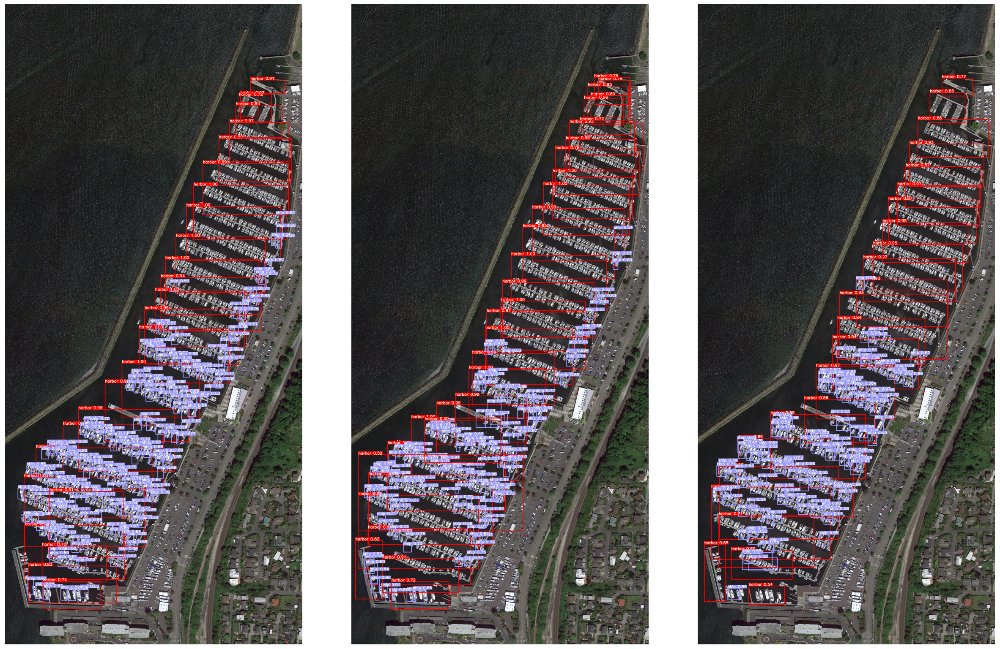

# BCD_YOLOv4: Multi-Scale Object Detection and Semantic Augmentation

## Overview

This repository introduces an enhanced YOLOv4-based object detection framework tailored for **multi-scale object detection**. The key contributions of this research include:

1. **Loss Function Modification**: Integration of distance-based metrics into the loss function:
   - **NWD (Normalized Wasserstein Distance)**.
   - **BCD (Bhattacharyya Distance)** *(proposed as the best-performing loss function)*.

2. **Semantic Contextual Augmentation**: Enhanced detection of small objects by augmenting DOTA satellite images with **contextually accurate placements** of small objects, emphasizing semantic properties to address challenges in small-object detection.

---

## Results

### Performance Evaluation
The table below illustrates the performance comparison across various object ratios and loss functions before and after augmentation:

| Object Ratio        | Method | Before Augmentation | After Augmentation |
|---------------------|--------|---------------------|--------------------|
| 5:1 (Small:Large)   | IoU    | 0.230               | 0.247              |
|                     | NWD    | 0.261               | 0.432              |
|                     | BCD    | 0.270               | **0.412**          |
| 3:3 (Small:Large)   | IoU    | 0.345               | 0.633              |
|                     | NWD    | 0.265               | 0.572              |
|                     | BCD    | 0.278               | **0.649**          |
| 1:5 (Small:Large)   | IoU    | 0.428               | 0.516              |
|                     | NWD    | 0.377               | 0.462              |
|                     | BCD    | 0.375               | **0.608**          |

### Detection Results

Figures illustrate detection results across various object distribution scenarios:

1. **Balanced Distribution (3:3 Small:Large)**
   : Left to Right: Bhattacharyya Distance (BCD), Normalized Wasserstein Distance (NWD), Intersection over Union (IoU).
   

2. **Small-Object-Dominant (1:5 Small:Large)**
   

3. **Large-Object-Dominant (5:1 Small:Large)**
   

---

## Installation

### Prerequisites
- Python 3.8+
- PyTorch 1.8+
- CUDA 10.2+
- Required Python libraries:
  ```bash
  pip install -r requirements.txt
  ```

### Dataset
- **DOTA Dataset**:
  - Download the dataset [here](https://captain-whu.github.io/DOTA/).
  - Modify `dota.yaml` to include dataset paths.

### Clone Repository
```bash
git clone https://github.com/GitSummin/BCD_Yolov4.git
cd BCD_Yolov4
```

---

## Usage

### Training
Run the following command to train the model:
```bash
python train.py \
  --device 0 \
  --batch-size 16 \
  --img 416 416 \
  --data dota.yaml \
  --cfg cfg/yolov4-pacsp.cfg \
  --weights '' \
  --name Results \
  --epochs 500
```

### Detection
Run the following command to perform detection:
```bash
python detect.py \
  --img 416 \
  --device 0 \
  --cfg cfg/yolov4-pacsp.cfg \
  --weights weights/best.pt
```

---

## Results and Visualization

- **Performance Table**: Detailed in the "Performance Evaluation" section.
- **Visual Comparisons**: Detection results for IoU, NWD, and BCD are visualized in Figures 1, 2, and 3.

---

## Source and Credits

- Original YOLOv4 repository: [WongKinYiu/PyTorch_YOLOv4](https://github.com/WongKinYiu/PyTorch_YOLOv4)

